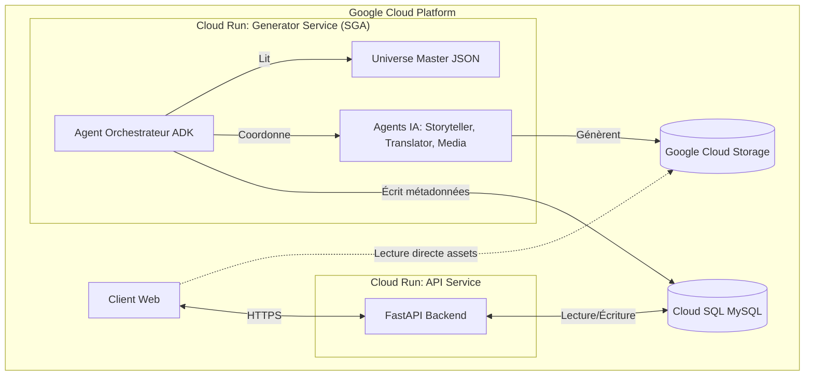

```markdown
# Podelli - Documentation Technique & Architecture v4 (Complète)

## 1. Vision Produit

Podelli est une **plateforme d'apprentissage des langues immersive de nouvelle génération**, propulsée par l'**IA générative**. Elle repose sur le concept d'**apprentissage par le dialogue et la mise en situation**, plongeant l'utilisateur dans un **univers narratif cohérent** (*"La vie à [Ville]"*).

L'objectif est de **simuler une immersion réelle** : l'utilisateur n'apprend pas des listes de vocabulaire isolées, mais **vit des scènes du quotidien** (aéroport, café, travail) pour acquérir des **compétences communicatives concrètes**.

---

## 2. Stack Technique & Infrastructure Google Cloud

L'architecture repose massivement sur l'écosystème **Google Cloud** pour assurer **scalabilité** et **intégration native avec les modèles IA**.

| Composant            | Technologie                          | Rôle |
|----------------------|--------------------------------------|------|
| **Frontend**         | HTML5, TailwindCSS, Vanilla JS       | Interface utilisateur réactive, lecture média, interactions (enregistrement audio, QCM). |
| **Backend API**      | FastAPI, Uvicorn, Docker             | API RESTful servant le contenu, gérant les utilisateurs et leur progression. |
| **Base de Données**  | Cloud SQL for MySQL                  | Stockage relationnel structuré du curriculum, des métadonnées médias et des données utilisateurs. Service géré pour la haute disponibilité. |
| **Stockage Fichiers**| Google Cloud Storage (GCS)           | Stockage objet pour tous les assets médias (vidéos MP4, audios MP3, images PNG). |
| **Déploiement**      | Google Cloud Run                     | Plateforme compute serverless pour héberger les conteneurs Docker de l'API Backend et du SGA. Assure une mise à l'échelle automatique. |
| **Orchestration IA** | Google AI SDK (ADK)                  | Cerveau du système autonome de génération de contenu. |
| **Modèles IA**       | Gemini 2.5 Pro, Veo 3.1 fast, Nano Banana, GPT-4o-TTS | Génération de texte, vidéo, image et audio respectivement. |

---

## 3. Architecture Système Globale

L'architecture est divisée en **deux services distincts** fonctionnant en parallèle sur **Google Cloud Run** :

1. **Le Service de Génération Autonome (SGA)** : Un système *"batch"* tournant en arrière-plan, responsable de la **création continue du contenu pédagogique**.
2. **L'API Runtime (FastAPI)** : Le système *"temps réel"* qui sert le **contenu pré-généré** aux utilisateurs et gère leurs interactions.



---

## 4. Le Service de Génération Autonome (SGA)

Le **SGA** est le **cœur intelligent** de Podelli. C'est une **"usine à contenu" autonome** qui fonctionne en continu pour **peupler la base de données**.

### 4.1 Principes Clés de Génération

- **Autonomie Totale** : Une fois lancé, le SGA n'a pas besoin d'intervention humaine. Il lit ses objectifs depuis un fichier de configuration et produit le contenu.
- **Cold Start & Génération Continue** :
  - **Cold Start** : Avant le lancement public, le SGA génère la **première mission** pour toutes les langues supportées (FR, EN, ES, DE, IT, PT-PT, PT-BR). Cela garantit que les premiers utilisateurs ont du contenu immédiat.
  - **Continu** : Pendant que les utilisateurs apprennent la Mission 1, le SGA génère déjà la **Mission 2** en arrière-plan.
- **Cohérence "Master-Slave"** : Pour garantir une pédagogie identique dans toutes les langues, le contenu est **d'abord conçu en anglais (Master)**, puis **localisé**.

### 4.2 Le Fichier "Universe Master JSON"

C'est le **point d'entrée unique** du SGA. Il définit la **structure macro** de tout le curriculum, **en anglais**.

```json
/* universe_master.json (Extrait) */
{
  "universe_title": "Life in [City]",
  "missions": [
    {
      "master_id": "M1_AIRPORT",
      "title": "Airport Arrival",
      "objective": "Master basic interactions at customs and baggage claim.",
      "cefr_level": "A1",
      "episodes": [
        {
          "master_id": "M1_E1_PASSPORT",
          "title": "Passport Control",
          "objective": "Learn to present ID and answer basic entry questions."
        }
        // ... autres épisodes
      ]
    }
    // ... autres missions (Restaurant, Shopping, etc.)
  ]
}
```

### 4.3 Flux de Génération Détaillé

L'**Agent Orchestrateur** suit ce **processus cyclique** pour chaque épisode défini dans le Master JSON :

1. **Lecture Master** : L'Orchestrateur lit l'objectif de l'épisode suivant (ex: *"Passport Control"*).
2. **Scénarisation (Agent Storyteller)** : Génération du **script pédagogique complet** en anglais (dialogues, descriptions de scènes, structure des quiz).
3. **Localisation (Agent Translator)** : Traduction du script Master vers les **7 langues cibles**.
4. **Production Visuelle (Agent Art Director)** :
   - Génération des **"Key Visuals"** (personnages, lieux) pour assurer la **consistance**.
   - Génération des **assets agnostiques** (ex: image d'un passeport) **une seule fois** pour toutes les langues.
5. **Production Média Localisée** :
   - **Audio (Agent Voice Actor)** : Génération des dialogues **TTS** dans chaque langue.
   - **Vidéo (Agent Video Director)** : Génération des **clips vidéo (Veo)** pour chaque langue, en utilisant les "Key Visuals" pour la cohérence des personnages.
   - **Voice Spells (Agent Phonetics)** : Création des vidéos spécifiques avec **transcription phonétique intuitive**.
6. **Enregistrement (Orchestrateur)** : Tout le contenu généré (liens GCS, textes traduits, structure des quiz) est **sauvegardé dans Cloud SQL**.

---

## 5. Modèle de Données (Cloud SQL)

Le schéma de base de données est conçu pour supporter le modèle **"Master-Slave"** et le **multilinguisme**.

### 5.1 Tables "Master" (Structure Pédagogique)

Ces tables (en anglais) définissent le **squelette invariant** du cours.

- `Mission_Master` : Définit l'objectif global d'une mission.
- `Episode_Master` : Définit le thème d'une scène.
- `Sequence_Master` : Définit les sous-parties d'un dialogue.

### 5.2 Tables de Contenu Localisé (Ce que l'utilisateur voit)

Ces tables contiennent les **versions traduites** et les **liens vers les médias spécifiques**.

- `Missions`, `Episodes`, `Sequences` : Versions localisées liées à leur Master.
- `Actions` : L'**unité atomique** (Quiz, Voice Spell, etc.). Contient le texte traduit (question, phrase à répéter) et le lien vers l'asset média.
- `Assets` : Catalogue central de tous les fichiers sur GCS, avec distinction entre **assets universels** (images) et **localisés** (audio/vidéo).

### 5.3 Schéma SQL Complet

```sql
-- ============================================================================
-- Podelli Database - Initial Schema
-- Target DBMS: MySQL 8.0+ (Google Cloud SQL)
-- ============================================================================

CREATE DATABASE IF NOT EXISTS podelli_db CHARACTER SET utf8mb4 COLLATE utf8mb4_unicode_ci;
USE podelli_db;

SET FOREIGN_KEY_CHECKS = 0;

-- 1. CORE TABLES
CREATE TABLE IF NOT EXISTS Languages (
    language_code VARCHAR(10) PRIMARY KEY,
    language_name VARCHAR(100) NOT NULL,
    universe_title VARCHAR(255) NOT NULL,
    created_at DATETIME DEFAULT CURRENT_TIMESTAMP
) ENGINE=InnoDB;

CREATE TABLE IF NOT EXISTS Assets (
    asset_id CHAR(36) PRIMARY KEY,
    asset_type ENUM('IMAGE', 'VIDEO', 'AUDIO') NOT NULL,
    storage_path VARCHAR(1024) NOT NULL,
    language_code VARCHAR(10) NULL, -- NULL for universal assets
    metadata JSON NULL,
    created_at DATETIME DEFAULT CURRENT_TIMESTAMP,
    FOREIGN KEY (language_code) REFERENCES Languages(language_code) ON DELETE SET NULL
) ENGINE=InnoDB;

-- 2. MASTER TABLES (English Source of Truth)
CREATE TABLE IF NOT EXISTS Mission_Master (
    mission_master_id VARCHAR(50) PRIMARY KEY,
    master_title VARCHAR(255) NOT NULL,
    master_objective TEXT NOT NULL,
    target_level_cecr VARCHAR(2) NOT NULL,
    created_at DATETIME DEFAULT CURRENT_TIMESTAMP
) ENGINE=InnoDB;

CREATE TABLE IF NOT EXISTS Episode_Master (
    episode_master_id VARCHAR(50) PRIMARY KEY,
    mission_master_id VARCHAR(50) NOT NULL,
    master_title VARCHAR(255) NOT NULL,
    master_dialogue_ref TEXT NULL,
    episode_order INT NOT NULL,
    created_at DATETIME DEFAULT CURRENT_TIMESTAMP,
    FOREIGN KEY (mission_master_id) REFERENCES Mission_Master(mission_master_id) ON DELETE CASCADE
) ENGINE=InnoDB;

CREATE TABLE IF NOT EXISTS Sequence_Master (
    sequence_master_id VARCHAR(50) PRIMARY KEY,
    episode_master_id VARCHAR(50) NOT NULL,
    master_description TEXT NOT NULL,
    sequence_order INT NOT NULL,
    created_at DATETIME DEFAULT CURRENT_TIMESTAMP,
    FOREIGN KEY (episode_master_id) REFERENCES Episode_Master(episode_master_id) ON DELETE CASCADE
) ENGINE=InnoDB;

-- 3. LOCALIZED CONTENT TABLES
CREATE TABLE IF NOT EXISTS Missions (
    mission_id CHAR(36) PRIMARY KEY,
    mission_master_id VARCHAR(50) NOT NULL,
    language_code VARCHAR(10) NOT NULL,
    title VARCHAR(255) NOT NULL,
    objective TEXT,
    created_at DATETIME DEFAULT CURRENT_TIMESTAMP,
    UNIQUE KEY unique_mission_lang (mission_master_id, language_code),
    FOREIGN KEY (mission_master_id) REFERENCES Mission_Master(mission_master_id) ON DELETE RESTRICT,
    FOREIGN KEY (language_code) REFERENCES Languages(language_code) ON DELETE CASCADE
) ENGINE=InnoDB;

CREATE TABLE IF NOT EXISTS Episodes (
    episode_id CHAR(36) PRIMARY KEY,
    episode_master_id VARCHAR(50) NOT NULL,
    mission_id CHAR(36) NOT NULL,
    language_code VARCHAR(10) NOT NULL,
    title VARCHAR(255) NOT NULL,
    description TEXT,
    dialogue_reference TEXT,
    created_at DATETIME DEFAULT CURRENT_TIMESTAMP,
    UNIQUE KEY unique_episode_lang (episode_master_id, language_code),
    FOREIGN KEY (episode_master_id) REFERENCES Episode_Master(episode_master_id) ON DELETE RESTRICT,
    FOREIGN KEY (mission_id) REFERENCES Missions(mission_id) ON DELETE CASCADE,
    FOREIGN KEY (language_code) REFERENCES Languages(language_code) ON DELETE CASCADE
) ENGINE=InnoDB;

CREATE TABLE IF NOT EXISTS Sequences (
    sequence_id CHAR(36) PRIMARY KEY,
    sequence_master_id VARCHAR(50) NOT NULL,
    episode_id CHAR(36) NOT NULL,
    language_code VARCHAR(10) NOT NULL,
    description TEXT,
    created_at DATETIME DEFAULT CURRENT_TIMESTAMP,
    UNIQUE KEY unique_sequence_lang (sequence_master_id, language_code),
    FOREIGN KEY (sequence_master_id) REFERENCES Sequence_Master(sequence_master_id) ON DELETE RESTRICT,
    FOREIGN KEY (episode_id) REFERENCES Episodes(episode_id) ON DELETE CASCADE,
    FOREIGN KEY (language_code) REFERENCES Languages(language_code) ON DELETE CASCADE
) ENGINE=InnoDB;

CREATE TABLE IF NOT EXISTS Actions (
    action_id CHAR(36) PRIMARY KEY,
    action_master_id VARCHAR(50) NOT NULL,
    sequence_id CHAR(36) NOT NULL,
    language_code VARCHAR(10) NOT NULL,
    action_type ENUM('VIDEO_QUIZ', 'VOICE_SPELL', 'QCM_TEXT', 'QCM_AUDIO', 'QCM_IMAGE', 'SPEAKING_TASK', 'TRANSCRIPTION', 'MATCHING') NOT NULL,
    order_in_sequence INT NOT NULL,
    main_text TEXT,
    content_json JSON,
    feedback_hint TEXT,
    primary_asset_id CHAR(36) NULL,
    created_at DATETIME DEFAULT CURRENT_TIMESTAMP,
    INDEX idx_sequence_order (sequence_id, order_in_sequence),
    FOREIGN KEY (sequence_id) REFERENCES Sequences(sequence_id) ON DELETE CASCADE,
    FOREIGN KEY (language_code) REFERENCES Languages(language_code) ON DELETE CASCADE,
    FOREIGN KEY (primary_asset_id) REFERENCES Assets(asset_id) ON DELETE SET NULL
) ENGINE=InnoDB;

CREATE TABLE IF NOT EXISTS Podes (
    pode_id CHAR(36) PRIMARY KEY,
    pode_master_id VARCHAR(50) NOT NULL,
    language_code VARCHAR(10) NOT NULL,
    pode_type ENUM('EPISODE_PODE', 'MISSION_PODE') NOT NULL,
    related_episode_id CHAR(36) NULL,
    related_mission_id CHAR(36) NULL,
    title VARCHAR(255) NOT NULL,
    scenario_json JSON NOT NULL,
    created_at DATETIME DEFAULT CURRENT_TIMESTAMP,
    FOREIGN KEY (language_code) REFERENCES Languages(language_code) ON DELETE CASCADE,
    FOREIGN KEY (related_episode_id) REFERENCES Episodes(episode_id) ON DELETE CASCADE,
    FOREIGN KEY (related_mission_id) REFERENCES Missions(mission_id) ON DELETE CASCADE
) ENGINE=InnoDB;

-- 4. USER & PROFILE TABLES
CREATE TABLE IF NOT EXISTS Users (
    user_id CHAR(36) PRIMARY KEY,
    email VARCHAR(255) NOT NULL UNIQUE,
    password_hash VARCHAR(255) NOT NULL,
    username VARCHAR(100) NOT NULL,
    native_language VARCHAR(10) NULL,
    created_at DATETIME DEFAULT CURRENT_TIMESTAMP,
    updated_at DATETIME DEFAULT CURRENT_TIMESTAMP ON UPDATE CURRENT_TIMESTAMP
) ENGINE=InnoDB;

CREATE TABLE IF NOT EXISTS Learning_Profiles (
    profile_id CHAR(36) PRIMARY KEY,
    user_id CHAR(36) NOT NULL,
    language_code VARCHAR(10) NOT NULL,
    current_level_cecr VARCHAR(2) DEFAULT 'A0',
    has_completed_onboarding BOOLEAN DEFAULT FALSE,
    is_active BOOLEAN DEFAULT FALSE,
    created_at DATETIME DEFAULT CURRENT_TIMESTAMP,
    updated_at DATETIME DEFAULT CURRENT_TIMESTAMP ON UPDATE CURRENT_TIMESTAMP,
    UNIQUE KEY unique_user_lang_profile (user_id, language_code),
    FOREIGN KEY (user_id) REFERENCES Users(user_id) ON DELETE CASCADE,
    FOREIGN KEY (language_code) REFERENCES Languages(language_code) ON DELETE RESTRICT
) ENGINE=InnoDB;

-- 5. PROGRESS TABLES
CREATE TABLE IF NOT EXISTS User_Action_Progress (
    progress_id CHAR(36) PRIMARY KEY,
    profile_id CHAR(36) NOT NULL,
    action_id CHAR(36) NOT NULL,
    score INT NULL,
    user_audio_asset_id CHAR(36) NULL,
    completed_at DATETIME DEFAULT CURRENT_TIMESTAMP,
    INDEX idx_profile_action (profile_id, action_id),
    FOREIGN KEY (profile_id) REFERENCES Learning_Profiles(profile_id) ON DELETE CASCADE,
    FOREIGN KEY (action_id) REFERENCES Actions(action_id) ON DELETE CASCADE,
    FOREIGN KEY (user_audio_asset_id) REFERENCES Assets(asset_id) ON DELETE SET NULL
) ENGINE=InnoDB;

CREATE TABLE IF NOT EXISTS User_Pode_Progress (
    pode_progress_id CHAR(36) PRIMARY KEY,
    profile_id CHAR(36) NOT NULL,
    pode_id CHAR(36) NOT NULL,
    comprehension_score INT DEFAULT 0,
    pronunciation_score INT DEFAULT 0,
    fluency_score INT DEFAULT 0,
    total_score INT GENERATED ALWAYS AS (comprehension_score + pronunciation_score + fluency_score) STORED,
    completed_at DATETIME DEFAULT CURRENT_TIMESTAMP,
    FOREIGN KEY (profile_id) REFERENCES Learning_Profiles(profile_id) ON DELETE CASCADE,
    FOREIGN KEY (pode_id) REFERENCES Podes(pode_id) ON DELETE CASCADE
) ENGINE=InnoDB;

CREATE TABLE IF NOT EXISTS Leaderboards (
    leaderboard_id CHAR(36) PRIMARY KEY,
    profile_id CHAR(36) NOT NULL UNIQUE,
    total_points BIGINT DEFAULT 0,
    weekly_points INT DEFAULT 0,
    visibility ENUM('PUBLIC', 'PRIVATE', 'FRIENDS') DEFAULT 'PUBLIC',
    updated_at DATETIME DEFAULT CURRENT_TIMESTAMP ON UPDATE CURRENT_TIMESTAMP,
    FOREIGN KEY (profile_id) REFERENCES Learning_Profiles(profile_id) ON DELETE CASCADE
) ENGINE=InnoDB;

SET FOREIGN_KEY_CHECKS = 1;
```

---

## 6. API Runtime & Expérience Utilisateur

Le backend **FastAPI** est l'**interface entre le contenu généré et l'utilisateur**.

### 6.1 Gestion des Profils d'Apprentissage

L'architecture supporte nativement le **multilinguisme** pour un même utilisateur via la table `Learning_Profiles`.

- Un utilisateur peut apprendre le **FR** et l'**ES** simultanément.
- Chaque langue a son **propre profil** (`profile_id`), sa **propre progression** et son **propre niveau CECR**.
- L'API bascule le contexte en activant le `is_active` du profil choisi.

### 6.2 Distribution et Évaluation

- **Feed Intelligent** : L'API interroge la base pour servir les missions dans l'**ordre pédagogique**, adaptées au profil actif.
- **Interaction Temps Réel (Agent Tuteur)** : Pour les tâches complexes comme la **prononciation**, l'API fait appel à un **agent ADK dédié** (Gemini 2.5 Pro) qui analyse l'**audio de l'utilisateur à la volée** et renvoie un **feedback immédiat**.

```